## 目次

+ [1. プロフィール](#profile)
+ [2. 直近で携わったゲーム](#feature)
    - [2-1. あやかし恋廻り](#ayakoi)
+ [3. 過去に携わったゲーム](#works)
    - [3-1. アニドルカラーズ](#anidol)
    - [3-2. 天下統一恋の乱](#tenka)
    - [3-3. 王子様のプロポーズ](#ouji)
    - [3-4. 鏡の中のプリンセス](#mirror)
+ [4. 連絡先](#contact)

***

##  1. プロフィール

* 名前：礪波瑞紀
* 性別：男
* 生年月日：1993/11/05
* 保有資格：応用情報技術者
* 得意分野： 
 Unity（C#） 
 Android（Java） 
 iOS（Objective-C）

***

## 2. 直近で携わったゲーム

### 2-1. あやかし恋廻り

    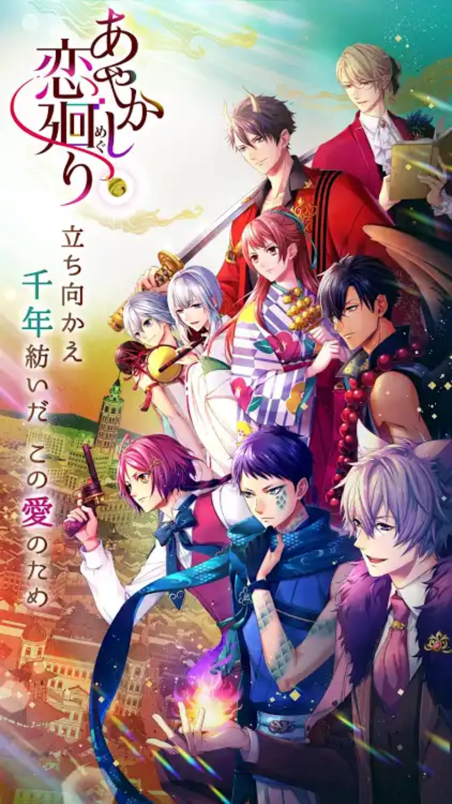
    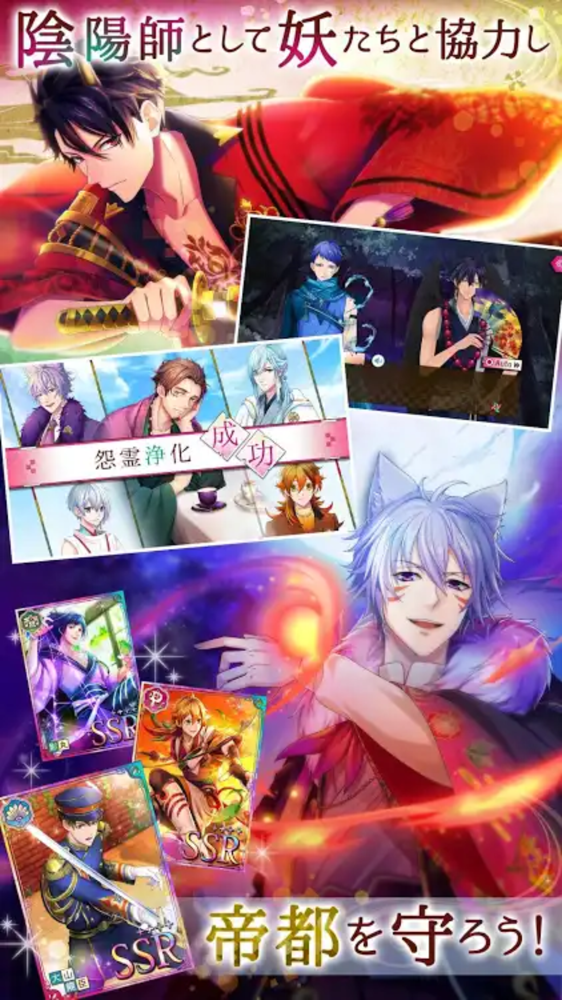
    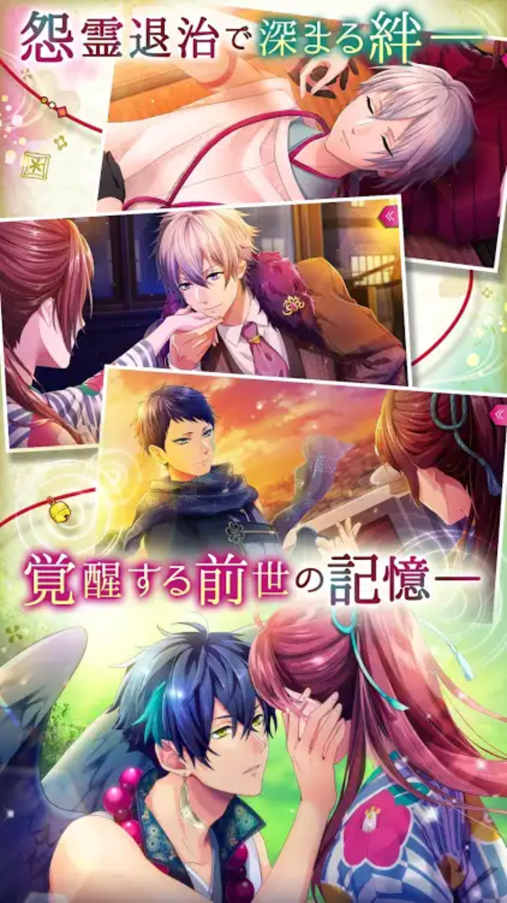
    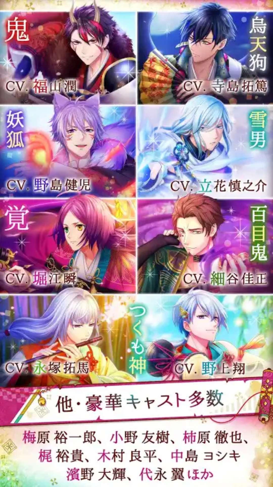

 

* 内容：女性向けカードゲーム（Android・iOS）
* 担当：クライアント側の設計～運用保守（Unity・C#）
* [公式サイト](https://products.voltage.co.jp/ayakoi/)
* コメント： 
 Unity製女性向けカードゲームアプリの新規開発、SIN後の運用保守までを担当しており 
 ストーリー・ガチャ・カード・見回り・ショップといった一通りの機能実装に携わりました。 
 UnityC#での作業としまして、画面UI作成からAPI・演出アニメーションとの繋ぎ込み、チューニング 
 必要に応じてJava・Objective-Cを用いてネイティブ側のプラグインの作成や、JenkinsでのCIも経験しました。 
 またSOLID原則に則った観点からのソースコードレビュー、ストアへのアプリ提出作業も日々行っておりました。 

***

## 3. 過去に携わったゲーム

### 3-1. アニドルカラーズ

    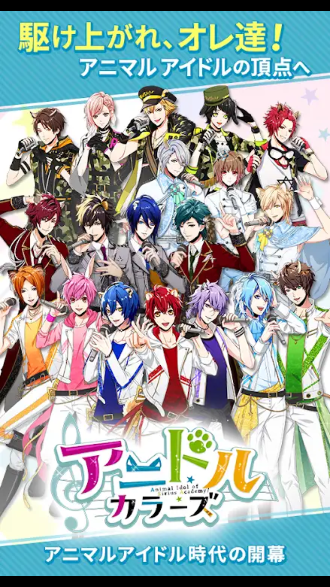
    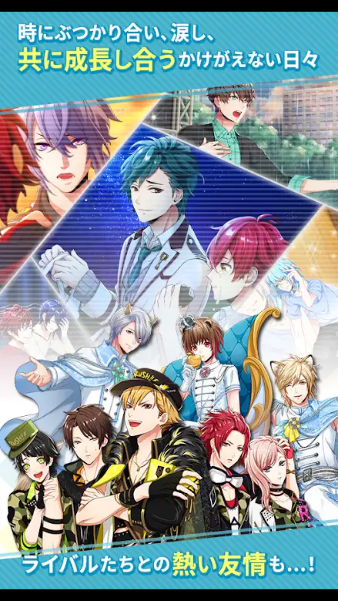
    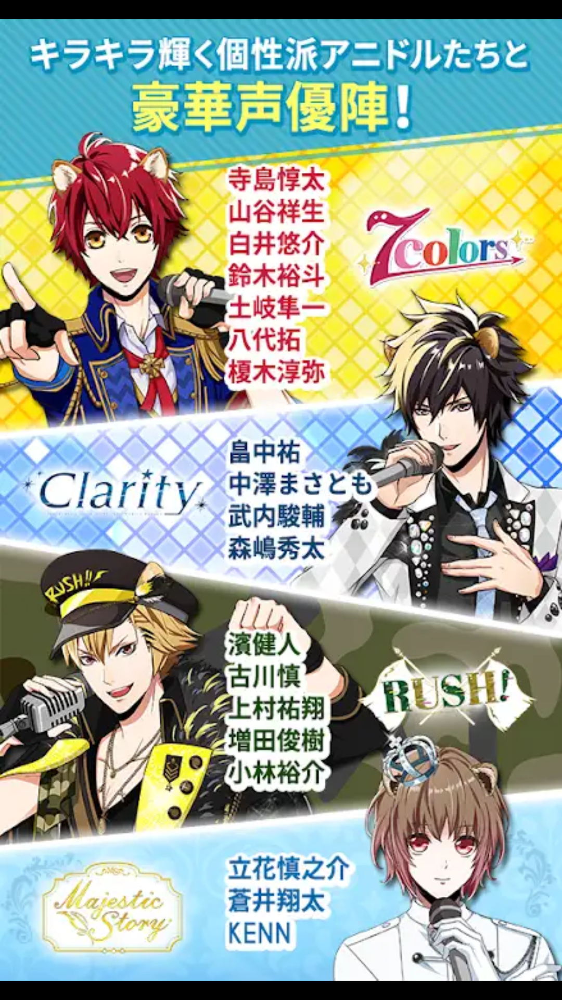
    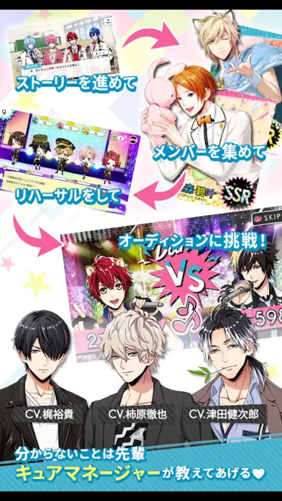

 

* 内容：女性向けカードゲーム（Android・iOS）
* 担当：クライアント側の設計～運用保守（Unity・C#）
* [公式サイト](https://dream.voltage.co.jp/anidol/index.php)

 

### 3-2. 天下統一恋の乱

    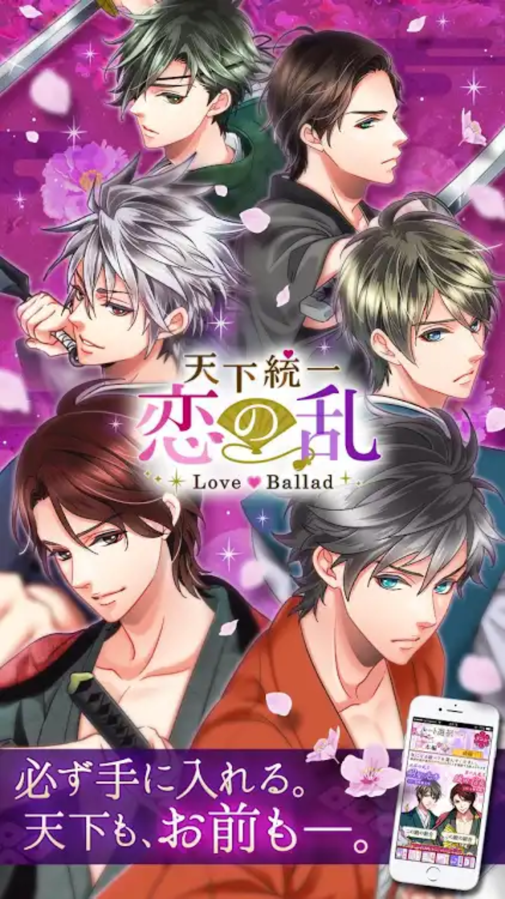
    
    
    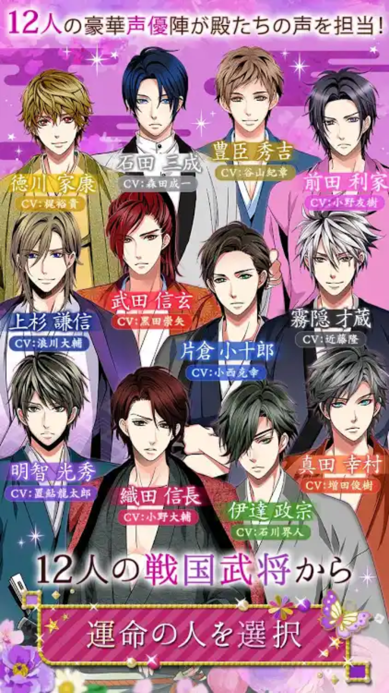

 

* 内容：女性向け恋愛シミュレーションゲーム（Android・iOS）
* 担当：クライアント側の設計～運用保守（Java・Objective-C）
* [公式サイト](https://products.voltage.co.jp/tenka/)

 

### 3-3. 王子様のプロポーズ

    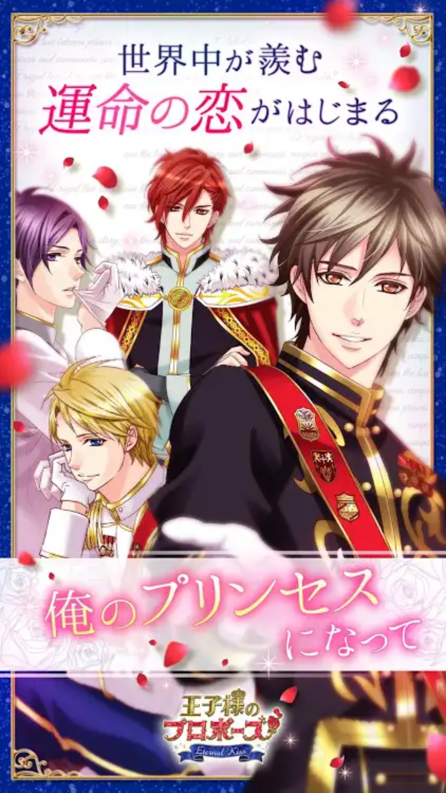
    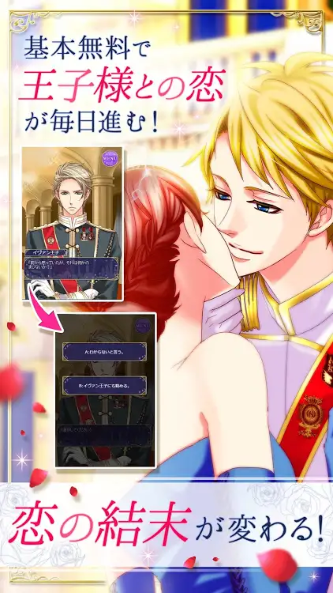
    
    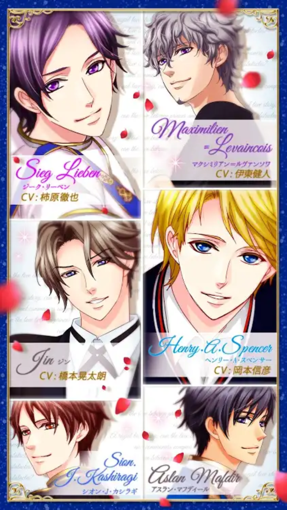

 

* 内容：女性向け恋愛シミュレーションゲーム（Android・iOS）
* 担当：クライアント側の設計～運用保守（Java・Objective-C）
* [公式サイト](https://products.voltage.co.jp/apps/ouji2/)

 

### 3-4. 鏡の中のプリンセス

    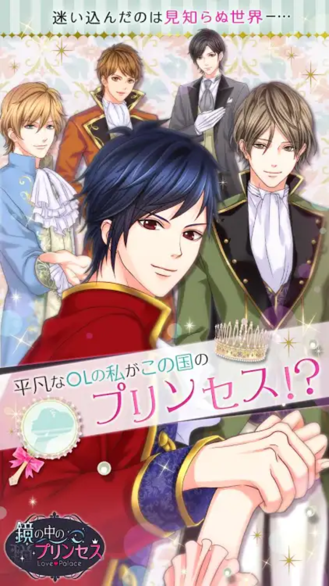
    
    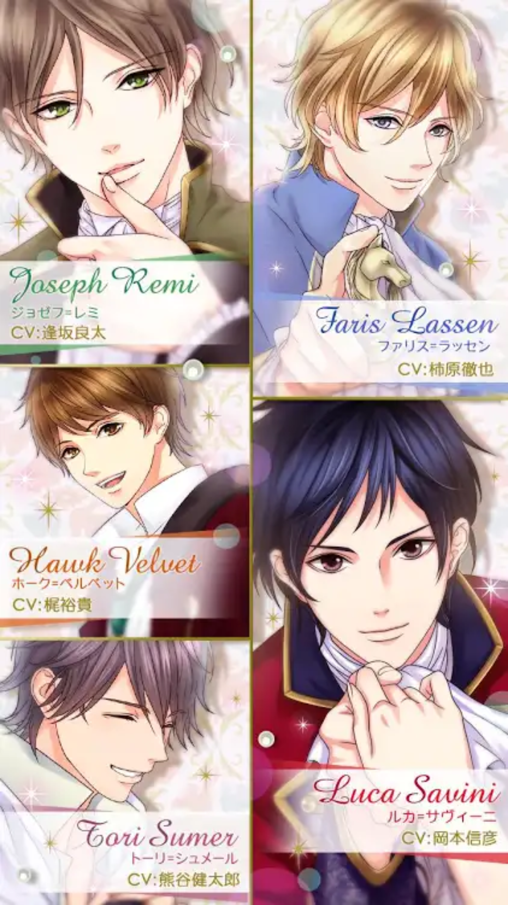
    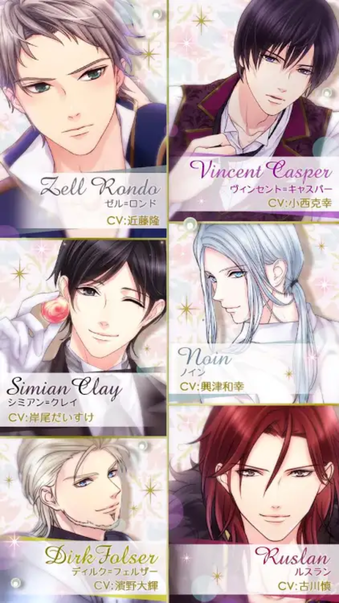

 

* 内容：女性向け恋愛シミュレーションゲーム（Android・iOS）
* 担当：クライアント側の設計～運用保守（Java・Objective-C）
* [公式サイト](https://products.voltage.co.jp/mirror/)

***

## 4. 連絡先

* TEL：080-2677-8959
* MAIL：oxlmnox@yahoo.co.jp
